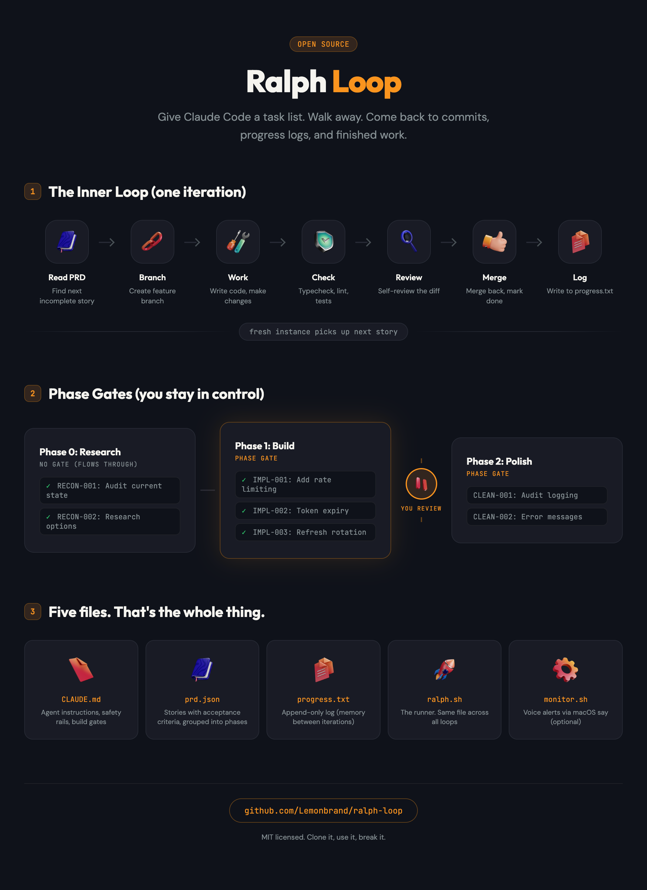

# Ralph Loop



Run [Claude Code](https://docs.anthropic.com/en/docs/claude-code) on autopilot. Give it a list of tasks, walk away, come back to finished work.

Ralph spawns a fresh Claude Code instance for each task. No context bleed between stories. The agent reads the task, does the work, checks itself, commits, logs what happened, and exits. Next instance picks up the next task.

You stay in control through **phase gates**: the loop pauses between phases so you can review before it continues. Your Mac literally says "Ralph hit a phase gate. Needs your review." out loud.

Built on [snarktank/ralph](https://github.com/snarktank/ralph) by Ryan Carson, extended with phase gates, voice alerts, sandboxing via [nono](https://github.com/always-further/nono), and headless git auth.

## What's in a loop

Five files in a directory. That's it.

```
scripts/ralph-myproject/
  CLAUDE.md       ← what the agent should do (instructions, safety rails)
  prd.json        ← the task list (stories with acceptance criteria)
  progress.txt    ← what actually happened (append-only, the agent's memory)
  ralph.sh        ← the runner (same file across all loops)
  monitor.sh      ← voice alerts when it needs you (optional)
```

## What happens when you run it

```
./ralph.sh --tool claude 10
```

Each of the 10 iterations:

```
  ┌─ Read prd.json, find next incomplete story
  │
  ├─ Create a feature branch (story/AUTH-001)
  │
  ├─ Do the work
  │
  ├─ Run checks (typecheck, tests, whatever you configured)
  │
  ├─ Self-review the diff
  │
  ├─ Merge back, mark story as done
  │
  ├─ Log everything to progress.txt
  │
  └─ Exit. Fresh instance picks up next story.
```

Stories are grouped into phases. When a phase is done, the loop stops:

```
  Phase 0: Research          Phase 1: Build (GATE)       Phase 2: Polish (GATE)
  ┌──────────────┐           ┌──────────────┐            ┌──────────────┐
  │  RECON-001   │──flows───▶│  IMPL-001    │──pauses───▶│  CLEAN-001   │
  │  RECON-002   │  into     │  IMPL-002    │  for you   │  CLEAN-002   │
  └──────────────┘           │  IMPL-003    │            └──────────────┘
                             └──────────────┘
```

Phase 0 flows straight through (no gate). Phase 1 stops for your review. You look at the code, approve it, re-run. Phase 2 does the same.

## Get started

### Option 1: CLI scaffold (recommended)

```bash
git clone https://github.com/Lemonbrand/ralph-loop.git
cd ralph-loop
./create-loop.sh
```

It asks you a few questions (name, goal, what it modifies, what tasks to run), then generates all 5 files into your project.

### Option 2: Copy and edit

```bash
cp -r templates/ /path/to/your-project/scripts/ralph-myloop/
chmod +x /path/to/your-project/scripts/ralph-myloop/ralph.sh
# Edit CLAUDE.md and prd.json for your use case
```

### Run it

```bash
cd scripts/ralph-myloop
./ralph.sh --tool claude 10
```

`--no-sandbox` skips [nono](https://github.com/always-further/nono) sandboxing if installed. The number is max iterations (default 10).

## Writing good stories

This is where most people mess up. Each story needs to be completable in one Claude Code session. One story, one commit.

Good:

```json
{
  "id": "AUTH-001",
  "title": "Add rate limiting to login endpoint",
  "description": "Add express-rate-limit to POST /api/auth/login. 5 attempts per IP per 15 min. Return 429 with Retry-After header.",
  "acceptance": [
    "Rate limiter on login route only",
    "429 includes Retry-After header",
    "Existing tests still pass",
    "New test covers rate limit trigger"
  ],
  "dependsOn": [],
  "passes": false,
  "priority": 1
}
```

Bad:

- "Build the auth system" (too big)
- "Refactor the codebase" (too vague)
- "Make it faster" (no criteria)

Keep it under 500 lines of change. 2-4 acceptance criteria. Use `dependsOn` when order matters.

## The PRD file

```json
{
  "name": "Auth Hardening",
  "branchName": "ralph/auth-hardening",
  "targetRepo": "/Users/you/your-api",
  "phases": [
    {
      "name": "Security Fixes",
      "phaseGate": true,
      "stories": [ ... ]
    }
  ]
}
```

| Field | What it does |
|-------|-------------|
| `id` | Story identifier. Shows up in commits and progress log |
| `acceptance` | Concrete checks. The agent verifies these before marking done |
| `files` | Hints: which files to read or modify |
| `dependsOn` | Story IDs that must pass first |
| `passes` | Agent flips to `true` when done |
| `priority` | Lower = picked first |
| `phaseGate` | `true` = loop stops after this phase for your review |

## Three modes

**Code** (`READ-WRITE`): For repo changes. Creates feature branches, writes code, runs typecheck/lint/tests, merges back. This is the default.

**Infrastructure** (`INFRASTRUCTURE`): For system-level stuff. SSH keys, cloud resources, deployments, config changes. Documents before/after state. Never destroys without verifying first.

**Research** (`RESEARCH`): Read-only. Gathers information, documents findings, changes nothing. Good for security audits, dependency analysis, architecture reviews.

The mode shapes the CLAUDE.md instructions (safety rails, build gates, workflow). Pick the one that fits.

## Voice alerts

`monitor.sh` checks progress every 2 minutes and talks to you:

- "Ralph hit a phase gate. Needs your review."
- "Ralph is blocked. Check progress."
- "Ralph loop complete."

Uses a state file so it doesn't repeat itself. Set it up with launchd on macOS:

```bash
# Create the plist (update the path to your monitor.sh)
cat > ~/Library/LaunchAgents/com.ralph-monitor.plist << 'EOF'
<?xml version="1.0" encoding="UTF-8"?>
<!DOCTYPE plist PUBLIC "-//Apple//DTD PLIST 1.0//EN"
  "http://www.apple.com/DTDs/PropertyList-1.0.dtd">
<plist version="1.0">
<dict>
    <key>Label</key>
    <string>com.ralph-monitor</string>
    <key>ProgramArguments</key>
    <array>
        <string>/bin/bash</string>
        <string>/path/to/your/loop/monitor.sh</string>
    </array>
    <key>StartInterval</key>
    <integer>120</integer>
    <key>RunAtLoad</key>
    <false/>
</dict>
</plist>
EOF

launchctl load ~/Library/LaunchAgents/com.ralph-monitor.plist
```

Or just run `watch -n 120 ./monitor.sh` in a terminal.

## Headless git auth

If you run loops in the background (cron, sandboxed, no GUI), your normal git auth won't work. Ralph handles this with environment variables that only exist inside the loop process. Your interactive git stays untouched.

Setup:

```bash
ssh-keygen -t ed25519 -f ~/.ssh/id_ed25519_ralph -C "ralph-headless"
# Add the public key to GitHub (Settings → SSH keys)
```

Then uncomment the headless auth block in `ralph.sh`. It rewrites HTTPS remotes to SSH at the transport layer (no remote URL changes needed) and disables commit signing for the headless context.

## nono sandboxing

[nono](https://github.com/always-further/nono) by [Luke Hinds](https://github.com/lukehinds) (creator of [Sigstore](https://sigstore.dev)) restricts what the agent can touch on your machine. Kernel-enforced isolation using Landlock (Linux) and Seatbelt (macOS). When `ralph.sh` detects nono on PATH, it wraps the agent automatically.

```bash
brew install nono

mkdir -p ~/.config/nono/profiles
cat > ~/.config/nono/profiles/ralph-loop.json << 'EOF'
{
  "extends": "claude-code",
  "allow": [
    {"path": "~/myproject", "access": "read-write"},
    {"path": "~/another-repo", "access": "read-write"}
  ]
}
EOF
```

The agent can read and write to the paths you allow. Everything else is blocked at the OS level. `--no-sandbox` bypasses it when you don't need it.

## Claude Code skills

You can also install this as a Claude Code skill for in-session loop creation:

1. Copy `templates/` into `.claude/skills/create-ralph-loop/` in your project
2. Reference it in your CLAUDE.md
3. Type `/create-ralph-loop` in a session to scaffold a new loop interactively

## Related projects

- [snarktank/ralph](https://github.com/snarktank/ralph): The original by Ryan Carson. Fresh-context-per-iteration autonomous loops. Start here if you want the simplest version.
- [nono](https://github.com/always-further/nono): OS-level sandboxing for AI agents by Luke Hinds. Optional, recommended for anything running autonomously.
- [Claude Code](https://docs.anthropic.com/en/docs/claude-code): Anthropic's CLI. `--dangerously-skip-permissions` enables autonomous operation (required for Ralph loops).

## Common questions

**How many iterations?** Number of stories + a few extra for retries. 10 stories usually finishes in 12-15 iterations.

**Story keeps failing?** After 3 attempts, the agent marks it blocked and moves on. Check progress.txt, fix the underlying issue, re-run.

**Multiple loops at once?** Yes. Different branches, different directories, no file conflicts. Each loop is self-contained.

**Add stories mid-run?** Edit prd.json directly. Set `passes: false`, give it a priority. Next iteration picks it up.

## License

MIT
